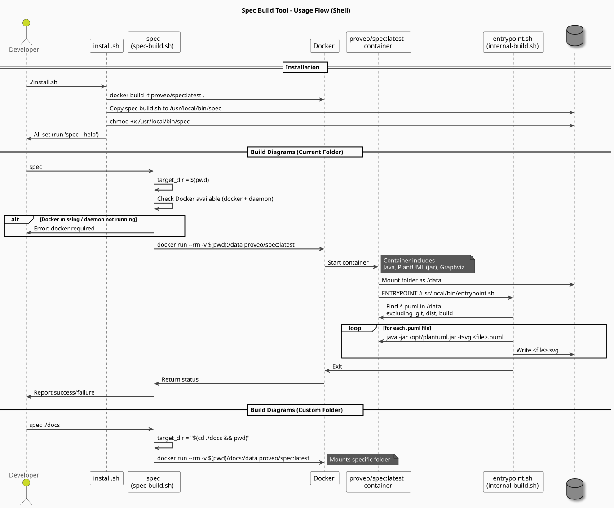
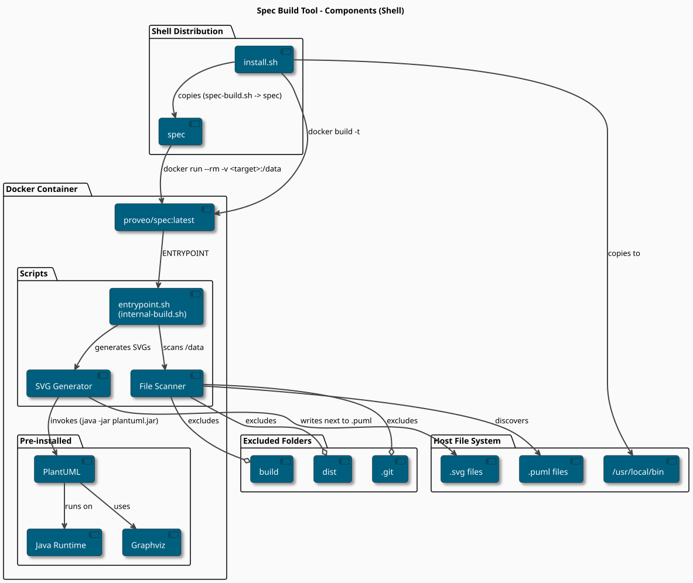

# Spec Build Tool

A lightweight, Dockerized utility to generate SVG diagrams from PlantUML files (`.puml`).

This tool encapsulates the Java Runtime, Graphviz, and PlantUML dependencies within a Docker container, allowing you to
build diagrams on any host with Docker installed without polluting your local environment.

## Requirements

* **Operating System:** Linux, macOS, or Windows (via WSL2/Git Bash).
* **Dependencies:**
  * [Docker Engine](https://docs.docker.com/engine/install/) (must be running).
  * Bash shell (version 4.0+ recommended).

## Build

The Docker image encapsulates the build logic. While the installer handles this automatically, you can build the image
manually if needed:

```bash
    docker build -t proveo/spec:latest .                                                                                                                                                                                                                                                                                
```

## Install

The provided installation script builds the Docker image and installs the wrapper script to your local bin.

1. Ensure the script is executable:

   ```bash
   chmod +x install.sh
   ```                                                                                                                                                                                                                                                                                                              


2. Run the installer:

   ```bash
   ./install.sh
   ```                                                                                                                                                                                                                                                                                                              

    *Note: You may be prompted for your password (`sudo`) to copy the executable to `/usr/local/bin`.*                                                                                                                                                                                                               

## Usage

Once installed, you can run the tool from any directory.

### Basic Usage

```bash
  spec    
```

```bash
  spec ./docs/diagrams                                                                                                                                                                                                                                                                                           
```

Generate diagrams for all `.puml` files in the current directory (recursive):

### Options

* `-v, --verbose`: Enable verbose output (shows internal Docker and PlantUML logs).
* `-d, --dry-run`: Print the Docker command without executing it.
* `--debug`: Enable shell debugging (`set -x`).
* `-h, --help`: Show help message.

### Behavior

* **Output:** Generates `.svg` files next to their source `.puml` files.
* **Exclusions:** Automatically ignores `.git`, `dist`, and `build` directories.

## Contributing

1. **Architecture:**

* `spec-build.sh`: The host-side wrapper.
* `Dockerfile`: The environment (Java + Graphviz).
* `internal-build.sh`: The logic running inside the container.

2. **Documentation:**

* See `spec/components.puml` for the component diagram.
* See `spec/usage.puml` for the execution flow.

3. **Conventions:**

* Follow the Bash conventions defined in the project.
* Ensure `install.sh` remains the single source of truth for setup.             

## Demo
See the files at https://github.com/proveo-ca/spec/tree/main/_spec
- Ruin:
  ```bash
  spec -v _spec/
  ```


